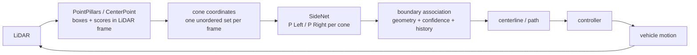

# SideNet 工程复盘：从锥桶坐标到有向赛道边界

> 复盘日期：2026-08-20<br>
> 复盘对象：SideNet、直接相关的 bitfsd-generator 数据链路、本地 OpenPCDet 接口 prototype<br>
> 当前判断：**DGCNN 已经是合理的 SideNet 工程 baseline；模型能力量级得到复现，但 unseen-track 与赛车闭环收益仍需系统实验。**

## Executive Summary

**SideNet 存在的原因，是 3D detector 的输出接口少了一项规划需要的信息。** 当前 PointPillars / CenterPoint 主路径把锥桶统一检测为 `Cone`，能回答“哪里有锥桶”，却不回答“这个锥桶属于 canonical driving direction 下的左边界还是右边界”。boundary reconstruction 需要这个有向边界身份，SideNet 就放在 detector 和 boundary association 之间，负责把一帧锥桶坐标集合转换成逐锥桶的 `P(Left), P(Right)`。

**独立后处理是一个工程解耦决策，不是理论上唯一的神经网络形式。** detector 的 post-NMS box 可以直接作为 SideNet 输入，SideNet 可以用独立的 side 标签数据快速训练、替换和回滚，不必改 detector 的 backbone、head 或训练集。若未来有足够联合标注，也可以把 side 做成 detector auxiliary head；当前选择两阶段，是因为接口稳定、迭代成本低，而不是因为 NMS 让一切联合训练都数学上不可能。

**DGCNN 的模型能力已经被实跑确认在历史合理量级。** 在历史 714-frame world-coordinate random split 条件下，本次固定 `model_seed=42 / split_seed=42` 完整训练 300 epochs，best checkpoint 在 epoch 248 获得 `4113/4344 = 94.68%` validation accuracy；独立推理入口复核得到完全相同的 accuracy、balanced accuracy 和 confusion matrix。它与历史 95.6% 相差 0.92 pp，处于用户指定的 94%–96% 合理区间，不值得继续为匹配单个旧数字反复搜索 seed 或 split。

**这个结果证明“DGCNN 能学会当前任务”，不证明“系统已经在未见赛道上变好”。** random-frame validation 的 train/val 共享所有 track families。更值得关注的是：总体 94.68% 的同时，最差 track `FSE22` 只有 80.72%，最差 frame 只有 52.38%。这说明平均 accuracy 会掩盖结构化场景尾部，而这些尾部更可能在 boundary、centerline 和 controller 中放大。

**当前真正值得继续做的只有三件事：**完成 ego-frame track-family holdout 的正式 DGCNN 实验；用真实 detector TP/FP/FN replay 验证域一致性与 abstention；做 `without SideNet / with SideNet` 的 boundary→planning A/B。严格 SE(2)/E(2) 等变网络、继续扩展模型 zoo、追逐历史 95.6% 的小数点，以及重写 detector 做端到端联合训练，目前都没有足够收益证据。

---

## 1. 问题：detector 找到了 Cone，但规划需要的是两条有向边界

### 1.1 最小系统链路



SideNet 的系统位置很窄：它不检测锥桶、不连接整条边界、不生成中心线，也不控制车辆。它只补齐 detector 与 boundary association 之间的 side semantic gap。

### 1.2 上下游接口

| 接口方 | 给 SideNet / 从 SideNet 取什么 | 当前契约 |
|---|---|---|
| PointPillars / CenterPoint | 每个 detection 的 box center 与 score | `xyz` 位于 ego/LiDAR frame；score 可选 |
| bitfsd-generator | 训练时的可见锥桶、side GT、ego pose 和噪声 | export 默认 canonicalize 到 ego frame，并写 metadata/manifest |
| SideNet | 一帧 (N\times D) 点集 | 默认 `D=3: [x^E,y^E,z^E]`；保持输入 index |
| SideNet 输出 | 每个 detection 的 side posterior | `P(Left), P(Right)`；可按 confidence abstain |
| boundary association | 消费 side、几何、置信度与历史 | 决定连接、拒绝虚警、维持边界 ID |

推荐输入变换为：

\[
p_i^E = R(-\psi_E)\left(p_i^W-t_E\right).
\]

真实 detector 的 `pred_boxes` 本来就在 LiDAR frame；generator 通过 [`src/export.py`](../../bitfsd-generator/src/export.py) 执行同一 canonicalization。SideNet 的 Python adapter 位于 [`infer.py`](../infer.py)，会对 checkpoint 的 coordinate frame 做显式断言。

### 1.3 Left/Right 是 track-global directed side

当前 target 是相对 canonical track direction 的边界身份：

- `Left`：沿允许行驶方向观察时的左边界；
- `Right`：沿允许行驶方向观察时的右边界；
- 正向行驶时通常与 ego-relative side 一致；
- 逆向行驶时 track-global identity 不交换，而 ego-relative side 会交换。

bitfsd-generator 现在把 `track_global / ego_relative` 作为显式参数，默认 collection 不生成 reverse `_flip` 数据（[`config/perceive.yaml`](../../bitfsd-generator/config/perceive.yaml)、[`src/perception.py`](../../bitfsd-generator/src/perception.py)）。这个约束比模型架构更重要：如果上下游对 Left/Right 的参考方向理解不同，任何高 accuracy 都没有系统意义。

---

## 2. 决策：为什么没有让 detector 直接输出 Left/Right

### 2.1 当前 detector 接口确实不能满足规划需求

当前单类 detector 配置输出 `Cone`，适合回答存在性和位置。它不包含 side posterior，因此 boundary association 还缺一层语义。这里的“不能满足”是**当前模型目标和接口不满足**，不是说 PointPillars / CenterPoint 永远不能做多类或多任务检测。

可选方案有三种：

| 方案 | 优点 | 代价 | 当前判断 |
|---|---|---|---|
| detector 直接分 `Cone_Left/Right` | 单模型、共享 LiDAR feature | 需要重新定义 detector labels；检测与 side error 耦合；迭代慢 | 可做长期对照，不是当前主线 |
| detector auxiliary side head | 可联合优化；NMS 前有可导监督 | 需要修改 detector、训练目标和部署 | 本地 OpenPCDet 有 prototype，但未完成系统验证 |
| 独立 SideNet postprocessor | 输入/输出清楚；模型小；数据与部署解耦；易回滚 | 额外模块和 latency；只能利用 box-set 信息 | **当前选择** |

### 2.2 两阶段的真正理由是模块化

[`docs/backprop_and_differentiability.md`](backprop_and_differentiability.md) 已把表述修正为：当前 post-NMS coordinate interface 无法让 side loss 改变 detector 的离散 box selection；若要联合训练，需要改用 GT center、dense BEV feature 或 multi-task target。

工程上先用独立模块有四个收益：

1. detector 可以继续以稳定的 `Cone` 类工作，SideNet 独立迭代；
2. side 标签和几何模拟数据不必与原始点云检测数据完全绑定；
3. DGCNN 约 91K 参数，部署、回滚、A/B 都简单；
4. 如果系统 KPI 证明 side inference 没有收益，可以直接移除，不影响 detector。

---

## 3. 实现：当前 SideNet 如何把接口落地

### 3.1 数据契约已经从“目录约定”升级为显式 manifest

当前推荐数据根为 `bitfsd-generator/output/sidenet_data_ego`：

- 14 个 track 目录；
- 643 个非空 frame；
- 21,073 个 cone observations；
- 每个 track 有 `metadata.yaml`，声明 coordinate frame、side semantics、frame list 和 ego poses；
- 根目录有 `dataset_manifest.yaml`，声明唯一 track 列表和 generator provenance。

[`sidenet_data.py`](../sidenet_data.py) 以 manifest 为 source of truth，不再把 output 下遗留目录或遗留 frame 静默纳入训练；coordinate frame、side semantics 或 schema 不匹配时 fail closed。

### 3.2 默认训练协议直接对应泛化问题

[`config.yaml`](../config.yaml) 与 [`configs/dgcnn.yaml`](../configs/dgcnn.yaml) 的默认条件是：

- `coordinate_frame: ego`；
- `side_semantics: track_global`；
- `input_mode: xyz`，不把 generator 的常数 score 当作 detector confidence；
- `strategy: track_holdout`；
- validation families：`FSCZ24 / FSG24 / FSS22`；
- 462 train frames / 181 validation frames，track-family overlap 为 0；
- model seed 与 split seed 分离；
- selection metric 为 macro-track accuracy。

训练入口 [`train_sidenet.py`](../train_sidenet.py) 保存 best 与 last checkpoint、完整 config、split frame ids、dataset SHA-256、per-epoch micro/balanced/F1/ECE/per-track metrics 和代码 provenance。

### 3.3 小点集和推理接口按真实使用方式处理

当前实现已经处理了此前影响工程可信度但不改变路线的小问题：

- `xy / xyz / xyzs` 会真实选择 2/3/4 个通道；
- DGCNN、PointNet、PointNet++ 不再通过跨 frame zero padding 构图；
- DGCNN 支持单点输入；
- PointNet++ 的 FPS 在 eval 中确定性运行，并支持 `N < nsample`；
- `infer.py --no-gt` 能消费行尾仅为 `Cone` 的 detector 文本；
- 低 confidence 可输出 `Unknown`，而不是强制归边。

软件回归结果为 **66 tests passed**；Ruff、Black、YAML、AST 和 manifest smoke 均通过。它们证明接口和复现链可运行，不等价于模型或闭环性能证明。

---

## 4. 技术路线：每个模型实验告诉了我们什么

历史实验应被理解为逐步增加合适 inductive bias，而不是为 DGCNN 编写“必然胜出”的故事。

| 方法 | 历史结果 | 它回答的问题 | 合理结论 |
|---|---:|---|---|
| k-NN, k=5 | 47.3% | 最近邻 label majority 是否足够 | 单纯 proximity vote 不够；旧实现还读取同帧 GT neighbor label，不是可部署 classifier |
| PointNet | 79.9% | 不显式建邻域，仅用 set-global context 能否学习 | 一帧点集包含 side 信号，但 global pooling 表达有限 |
| PointNet++ | 83.1% | 分层 sampling/grouping 是否带来局部结构收益 | 有小幅提升；对每帧几十点的任务，层级采样复杂度收益有限 |
| Transformer | 文档 92.4%；现存旧 checkpoint 约 91.25% | 全局 all-to-all context 是否有效 | 全局关系很有用；但它也容易利用 absolute position，且对本任务偏重 |
| DGCNN | 历史文档 95.6%；本次完整复现 94.68% | 显式局部 edge geometry 是否更匹配任务 | 当前观察中最强、最轻量的 baseline；仍不是理论最优证明 |

### 为什么 DGCNN 目前是合理方案

DGCNN 的 EdgeConv 直接使用 `neighbor - central` 和 central feature，符合“边界 side 由邻域形状与相对位置共同决定”的直觉。三层 dynamic graph 能扩展局部 receptive field，参数量约 91K，适合快速 replay 和车载部署验证。

这里的工程结论是：

> **DGCNN 已经足够好，值得进入更严格的系统验证；没有证据表明继续换模型会比修正数据域和验证下游更有价值。**

DGCNN 不是严格 translation/rotation-equivariant，也不保证 hairpin 中 Euclidean neighbor 等于 boundary topology neighbor。但这些是需要 failure evidence 才升级的具体风险，不是现在推翻 baseline 的理由。

---

## 5. 证据：94.68% 证明了能力量级，也暴露了平均值的边界

### 5.1 完整复现实验条件

本次实际执行：

```text
config:       configs/dgcnn_legacy_random.yaml
corpus:       714 frames / 21,877 cones / 15 directories
input:        world-coordinate xyzs（历史兼容条件）
split:        random_frame, 572 train / 142 val frames
split seed:   42
model seed:   42
epochs:       300
parameters:   91,458
selection:    validation micro accuracy
best epoch:   248
```

本地实验产物保存在 `runs/dgcnn_legacy_random/`：`metrics.jsonl`、
`split_manifest.json`、`independent_eval.log`、best checkpoint 和 last
checkpoint。`runs/` 按项目约定不提交模型产物；可复核的条件与结果完整记录在本节。

checkpoint provenance 记录了 SideNet base commit `4d48ef7` 与 `worktree_dirty=true`，因为本轮接口修复尚未提交。因此该 run 足以作为内部能力复核；若用于论文或正式 release，应在 clean commit 上重跑并发布同一组 artifact。

### 5.2 结果与独立复核

| 指标 | 结果 |
|---|---:|
| validation micro accuracy | **94.6823% = 4113 / 4344** |
| balanced accuracy | 94.6829% |
| macro F1 | 94.6819% |
| macro-frame accuracy | 95.3544% |
| macro-track accuracy | 94.7115% |
| ECE, 15 bins | 3.8856% |
| confusion | Left→Right 113；Right→Left 118 |
| worst track | FSE22：80.7229% |
| worst frame | FSE24/cloud_14：52.3810% |

训练保存的 best checkpoint 用独立 `infer.py` 重新加载，并严格恢复 checkpoint 的 142 validation frames；accuracy、balanced accuracy、confusion 和 per-track result 与训练记录一致。

历史 95.6% 与本次 94.68% 相差 **0.92 percentage point**。两者都支持同一个工程判断：DGCNN 在历史同分布条件下具有约 95% 的分类能力。继续搜索 seed/split 去匹配旧数字，不会改变模型选择或系统下一步，因此不再进行。

### 5.3 这项实验证明和没有证明什么

**[事实] 已证明：**

- 当前 DGCNN 代码可以稳定训练到历史合理量级；
- best checkpoint、split 和独立 evaluation 形成闭合证据链；
- Left/Right 两类整体没有明显 class imbalance 偏置；
- error 在 track/frame 间显著不均匀。

**[未证明]：**

- 未见 track 上仍有约 95%；
- ego-frame 正式协议与 world legacy 条件等价；
- 真实 detector box、score、FP/FN 上仍有同样表现；
- 94%–96% 的 side accuracy 一定改善 boundary、path 或 lap success。

random-frame split 的 train/val 共享全部 track families，因此该 run 是 model-capability check，不是 generalization acceptance。最差 track 与最差 frame 比平均 accuracy 更直接地说明：下一步应该定位场景尾部和系统敏感性，而不是继续优化总体小数点。

---

## 6. 系统影响：什么样的分类错误会真正传到 controller

SideNet 错误并不等价。下游是否受影响，取决于错误的空间相关性、置信度、位置和 association 的容错能力。

| SideNet error pattern | boundary reconstruction | centerline / planning | controller / vehicle | 工程判断 |
|---|---|---|---|---|
| 单个、低置信误分 | 可被几何连续性或 width gate 拒绝 | 通常无明显变化 | 通常无影响 | 不应过度优化 |
| 连续多个同侧锥桶误分 | 可能跨边连接或生成断裂 | 中心线偏移、曲率异常 | steering/jerk 增大 | 高价值 failure bucket |
| 部分区段 Left/Right swap | 两条边界局部交叉、ID 切换 | path 跳变或选错 corridor | 瞬时控制尖峰、出界风险 | 高严重度 |
| 整帧完整 swap | 无向中点可能暂时不变；有向 boundary ID 改变 | history/方向约束可能跳变 | 取决于 planner 是否依赖 side identity | 需系统实测，不能仅看 accuracy |
| 虚警被高置信归边 | 生成伪 boundary branch | path 被拉向伪点 | clearance 降低 | 需要 abstention/association reject |
| 单边大面积漏检 | SideNet 无法补回不存在的点 | 依赖 width prior/history 外推 | 长时误差累积 | detector/association 问题，不应归咎模型 |
| coordinate-frame 错配 | 全帧预测失真 | 边界整体错误 | 立即产生危险轨迹 | 接口断言比换模型更重要 |

因此，“4.4% error”本身不是系统风险定义。真正需要测的是：error 是否成簇、是否发生在 apex/发夹弯/稀疏区、是否高置信，以及 boundary association 能否把它吸收。

---

## 7. 评价：离线模型指标和系统 KPI 各自负责什么

### 7.1 离线模型层必须报告

| 指标 | 用途 |
|---|---|
| micro / balanced accuracy、macro F1 | 确认基本分类能力与类偏置 |
| macro-frame、macro-track、worst-track | 防止大 track/大 frame 掩盖尾部 |
| per-scenario bucket | 直道、弯道、hairpin、稀疏、single-side、噪声等级 |
| ECE / NLL / coverage-risk | 决定 confidence 和 abstention 是否可交给 association |
| reflection/pose consistency | 验证 augmentation 与 coordinate contract |
| p50/p95/p99 latency | 确认目标硬件 deadline，而不是只报平均 `<1 ms` |

离线 acceptance 应以 track-family holdout 为主；random-frame 只保留为 model-capability smoke。

### 7.2 最终系统必须报告

| 层级 | KPI |
|---|---|
| boundary | association precision/recall、crossing、branch、断裂长度、side-ID switch |
| centerline | lateral/heading/curvature error、95th percentile、temporal jump |
| planning | path deviation、curvature/jerk、replan oscillation、minimum clearance |
| controller / mission | off-track rate、lap completion、task success、deadline miss |

SideNet 只有在 `with SideNet` 相对 `without SideNet` 或简单 geometric baseline 改善 L2/L3 KPI，且 latency/安全 guardrail 不退化时，才算完成系统价值证明。

---

## 8. 当前 Decision Log

| ID | 问题 | 决策 | 证据 | 当前状态 |
|---|---|---|---|---|
| D-01 | detector 只输出 `Cone`，规划需要有向边界 side | 增加独立 SideNet postprocessor | 接口简单，可单独训练/部署 | 保留 |
| D-02 | world coordinates 与 detector LiDAR frame 不一致 | generator 和 runtime 统一到 ego/LiDAR frame | manifest 和 coordinate assertions 已实现 | 已落地，待正式模型实验 |
| D-03 | random-frame 只能测同分布能力 | 默认改为 track-family holdout | 当前 split 462/181 frames，group overlap=0 | 已落地 |
| D-04 | 多种 set model 中选择部署 baseline | 选择 DGCNN | 历史最高；本次完整复现 94.68%；约 91K 参数 | 当前 baseline，不宣称理论最优 |
| D-05 | 是否立即使用严格 equivariant model | 暂不升级 | 尚无 canonicalized track-holdout transform-specific failure | 延后 |
| D-06 | 是否把 side 合入 detector | 暂不重构 | 当前模块化方案尚未做系统 A/B；先验证价值 | 延后 |
| D-07 | 是否继续追历史 95.6% | 停止追数 | 94.68% 已在合理量级，差异不改变决策 | 关闭 |

---

## 9. 当前真正剩下的风险

这里仅保留会改变系统决策的风险，不扩展理论漏洞清单。

### 9.1 unseen-track 与场景尾部

历史能力 run 的最差 track 只有 80.72%，说明 track/layout 分布会显著影响结果。当前默认 grouped holdout 已解决评测设计，但还没有完成 300-epoch 正式实验。

### 9.2 generator geometry 与真实 detector domain 的差异

新数据已经统一 coordinate frame，但 generator 仍主要模拟 Gaussian jitter、dropout 和可见范围；真实 detector 还有 range-dependent bias、NMS merge、结构化 FP/FN 和非恒定 score。仅在 generator 上训练不能替代 detector replay。

### 9.3 下游对 side error 的真实敏感性未知

如果 boundary association 已有很强的几何/时序约束，SideNet 的大部分单点收益可能被吞掉；反过来，如果 planner 强依赖 side ID，少量 correlated errors 也可能非常危险。没有 L2/L3 A/B 之前，不能仅从 94.68% 判断 SideNet 的最终价值。

---

## 10. 下一阶段只做三件事

### 10.1 完成 ego-frame DGCNN track-family holdout

**假设：**去掉 absolute track position 后，DGCNN 仍能依靠 ego-aligned local geometry 在未见 track 上稳定工作。

**实验：**使用 [`configs/dgcnn.yaml`](../configs/dgcnn.yaml)，固定同一 validation families，运行 3–5 个 model seeds；报告 mean±std、worst-track、per-scenario bucket、ECE 和 p99 latency。

**触发下一步：**如果 median/worst-track 满足预设组件 gate，就冻结模型，不继续 architecture search；如果主要失败集中在 sparse/single-side，优先加 history/abstention；只有明确的 pose/reflection inconsistency 才讨论 equivariant variant。

### 10.2 用真实 detector predictions 做 replay

**假设：**generator-trained SideNet 能迁移到 PointPillars/CenterPoint 的 box error distribution。

**实验：**对 detector outputs 与 GT 做 matching，分别统计 TP side accuracy、FP confidence/abstention、FN 对 boundary coverage 的影响，以及按 distance/score/point-count 的 performance。

**触发下一步：**如果主要问题是 coordinate/score calibration，修 adapter/calibration；如果是结构化 detection error，补 detector-domain training，而不是先换 SideNet backbone。

### 10.3 做 boundary→planning A/B

**假设：**SideNet posterior 能让 association 构建更稳定、更准确的两条有向边界。

**实验：**同一 detector replay 下比较 `no SideNet`、简单 ego geometric baseline、DGCNN；观察 boundary crossing/ID-switch、centerline error、path jump、clearance、off-track 和 end-to-end latency。

**验收：**只有 DGCNN 在系统 KPI 上有稳定收益且 guardrail 不退化，才进入主规划链或实车闭环。

---

## 11. 目前不值得继续投入什么

- **不再追逐历史 95.6%。** 94.68% 已证明同一能力量级；0.92 pp 不改变任何架构或系统决策。
- **不扩展更多模型 zoo。** k-NN、PointNet、PointNet++、Transformer、DGCNN 已覆盖从简单局部到全局 attention 的主要假设。
- **不立即上 strict SE(2)/E(2) / steerable network。** DGCNN 已属于广义 geometric deep learning；只有 canonicalization 后仍有 transform-specific failure 才值得增加复杂度。
- **不立即重写 detector 做联合训练。** 两阶段模块化方案尚未完成系统 A/B；在证明接口是瓶颈前，联合训练只会增加耦合。
- **不把 reverse driving 做成默认 augmentation。** 当前比赛/规划 contract 是 canonical direction；没有系统需求时，不为理论完备性扩大任务。

这些“暂不做”是正式工程结论：资源应集中在 generalization、detector domain 和 downstream impact，而不是模型新颖度。

---

## 12. 如果重新做一次，我会更早做什么

1. 先冻结 `coordinate_frame + side_semantics + direction` 接口，再生成第一份数据。
2. 第一轮就使用 track-family holdout，并保存 split/checkpoint/provenance。
3. 在模型 sweep 同时接一个最小 boundary reconstruction proxy，而不是只积累 accuracy。
4. 先跑 ego lateral-sign 与 train-reference k-NN baseline，明确学习模型究竟增加了什么。
5. 早期就用少量真实 detector replay 检查 z、score、FP/FN 和 NMS error domain。

---

## Final Engineering Verdict

SideNet 是一个明确的接口模块：它把单类锥桶 detector 的几何输出，转换为 boundary reconstruction 所需的有向 side posterior。两阶段设计在当前阶段提供了最好的模块化、迭代和回滚能力。

DGCNN 已通过完整训练和独立复核证明具有约 95% 的历史同分布能力，因此“模型能不能学会”不再是主要问题。下一阶段不应继续证明 DGCNN 比另一个模型高零点几个百分点，而应回答三个更接近赛车闭环的问题：**未见赛道是否稳定、真实 detector 误差是否可迁移、side posterior 是否真的改善 boundary 与 path。**
